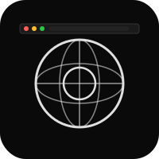

# Browser for iOS


Native iOS web browser built on WebKit. No Chromium.

## Features

- Tab switcher with pinning, suspension, private browsing
- Content blocker with bundled easylist rules
- Reader mode with font/size/background controls
- HTTPS-only mode with automatic upgrade
- Crash recovery (state saved every 30s)
- Bookmark folders with swipe-to-delete
- History search, autocomplete, find in page
- Configurable search engine, favicon fetching

## Run

```bash
xcodegen generate
xcodebuild -scheme BrowseriOS -destination 'platform=iOS Simulator,name=iPhone 17 Pro' build
```

## Roadmap

- [ ] iCloud sync with macOS companion
- [ ] Safari extension import
- [ ] Passkey / WebAuthn support

## Changelog

- v2.0.0 - Added tab pinning, suspension, and private browsing controls
- v2.0.0 - Added content blocker with bundled easylist rules
- v2.0.0 - Added reader mode and HTTPS-only automatic upgrades

## License

MIT 2026 Joshua Trommel
